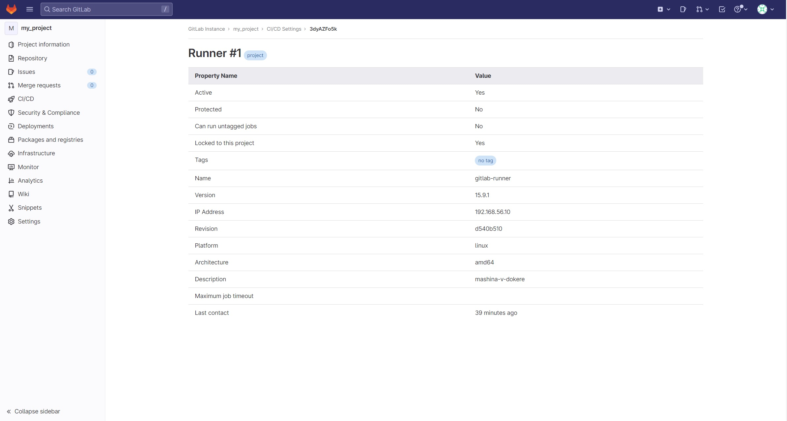
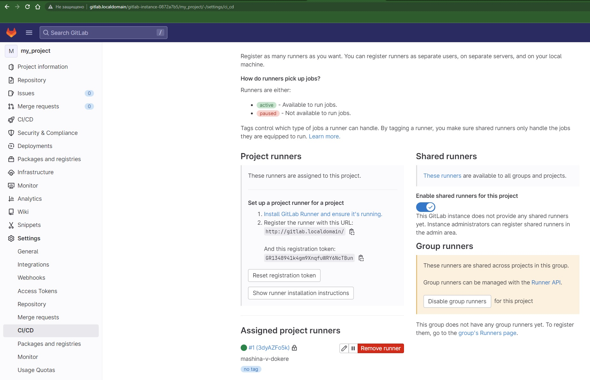
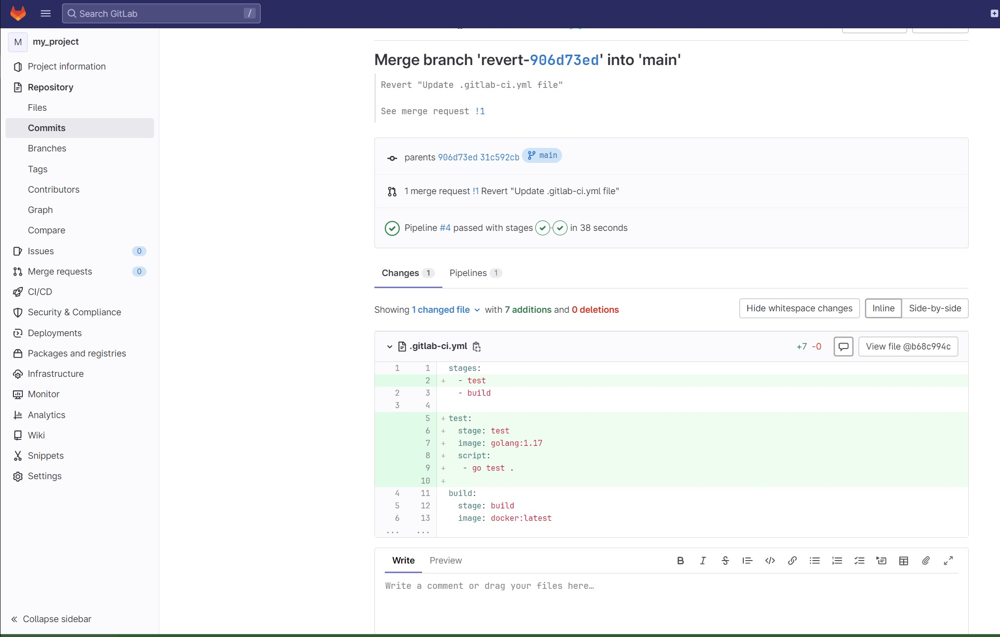
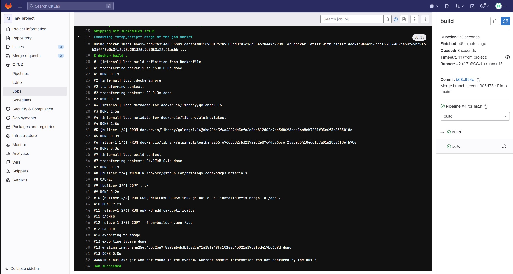

# Домашнее задание к занятию "`8-03hw`" - `Ливчак Сергей`

---

### Задание 1

`Установка gitlab и настройка ранера в проекте "my_project"`

1. `Развернул виртуальную машину на локальном пк через vagrant на windows`
2. `Зарегестрировал runner "mashina-v-dokere"`

**Скриншот 1**


**Скриншот 2**


---

### Задание 2

`Копирование репозитория и исполнение pipeline`

1. `Нужно запушить скачаный репозиторий в свой gitlab`  
	В процессе столкнулся с тем что он увидел в моём гитлаб существующий
	проект (хоть и пустой), пришлось сделать 
	"git pull origin main --allow-unrelated-histories"
	"git push --set-upstream origin main"
2. `ссылка на пайплайн который я использовал для выполнения задания`  
	<[Gitlab-ci]> Сам не придумывал, взял из упражнения  


**Скриншот 3**  
  

**Скриншот 4**  



---

### Задание 3

`Приведите ответ в свободной форме........`

1. `Заполните здесь этапы выполнения, если требуется ....`
2. `Заполните здесь этапы выполнения, если требуется ....`
3. `Заполните здесь этапы выполнения, если требуется ....`
4. `Заполните здесь этапы выполнения, если требуется ....`
5. `Заполните здесь этапы выполнения, если требуется ....`
6. 

```
Поле для вставки кода...
....
....
....
....
```

`При необходимости прикрепитe сюда скриншоты
`


[Gitlab-ci]: https://github.com/Livchak/8-03hw/blob/main/gitlab-ci.yml